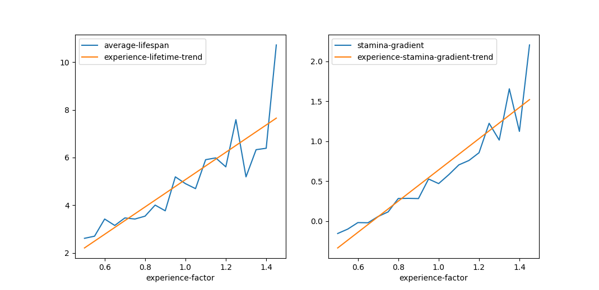
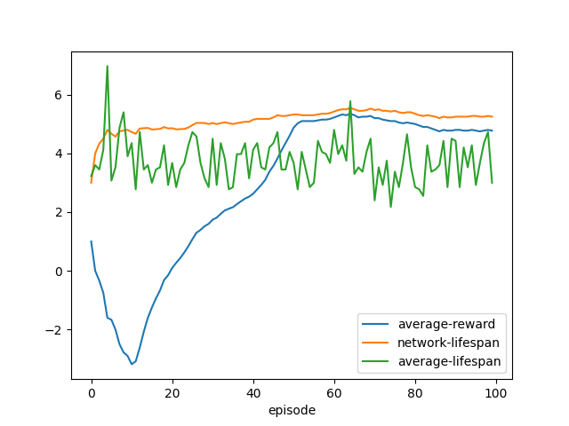
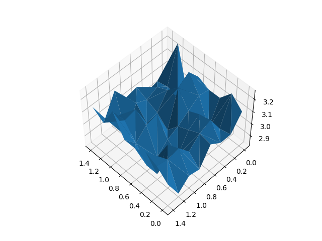

# Self-Organizing Multi-Agent Systems Coursework 2022-2023

This repository contains two things:

- A model of the "escape-the-pit" game
- A simple DDPG neural network implementation

Files of interest: 

- [The intelligent actor peasant](./source/game/actors/ddpg_peasant.py)
- [The game function itself](./source/game/game.py)

For more reading about the ML techniques used, see:

- [Keras' page on DDPG](https://keras.io/examples/rl/ddpg_pendulum/)

Here are some pretty figures obtained from the training process:

### Choosing an Experience Reward Factor

### Selfish Actor Training Convergence

### Failed Multivariable Weight Analysis

